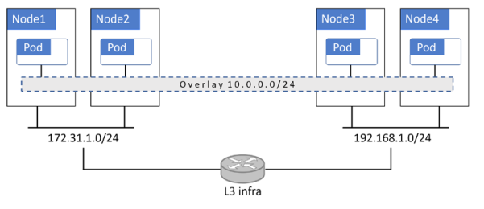
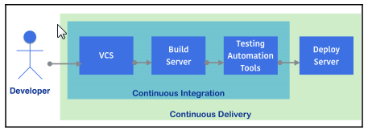

title: Introduction à Kubernetes
pre:<i class="fas fa-shopping-cart"></i>
authors: eljyw
date: 31/10/2019

# Introduction Kubernetes
<i class="md-icon">&#xE87C;</i><i class="md-icon">face</i>
<i class="md-icon">shopping_cart</i>
## traduction
- fully-fledged : à part entière
- meshes : mailles 
- discrepancy: contradiction
- ingress : entrée
- claim :   demande, revendication ( PVC : Persistant Volume Claims, demande de volume persistant)
- worth it: ça vaut le coup
- sprawl : étalement
 
## Glossaire
- cluster : ensemble de machines (VM, physique,) , formant un ou plusieurs masters et une collection de nodes
- masters ou control plane : forment les éléments de pilotage du cluster k8s
- nodes ou data plane : forment l'ensemble des machines sur lesquelles vont s'éxécuter les déploiements.
- controleurs : le déploiement des pods via des controleurs : Deployments, DaemonSets, StatefulSets, CronJobs,etc.
    - CronJobs : comme son nom l'indique
    - DeamonSets : sera lancé sur tous les noeuds
    - StatefulSets : pour les besoins de persistance
    - Deployments: le truc classique permettant de beneficier de la scalabité et des rolling update
- pod : unité atomique de déploiement, peut contenir plusieurs containers
- service : fait le lien entre plusieurs pod pour leur donner un point d'attache vis à vis de l'exterieur.

## Présentation générale
les configurations les plus simples exécutent tous les services principaux formant le master sur un seul hôte.
C'est bien pour une configuration de aboratoire ou d'environnement de test, mais pour 
les environnements de production, la haute disponibilité multi-master est un élément indispensable. 
C’est pourquoi les principaux fournisseurs de cloud metten en œuvre des masters HA (High Availability) 
dans le cadre de leurs solutions.
Entre 3 et 5 masters répliqués sont un bon début pour la production.

Des offres de providers KaaS (Kubernetes-as-a-Service) :
- Azure Kubernetes Service (AKS),
- AWS Elastic Kubernetes Service (EKS),
- Google Kubernetes Engine (GKE).

kubernetes DNS : une adresse IP statique hard codéee dans tous les pods !!!
basé sur CoreDNS

Pour le master
api-server
Cluster Store -> etcd
Cloud Controller manager
scheduler
Controller Manager

sur un node
kubelet
cri-containerd
kube-proxy

Les pods : vient de l'expression groupe de baleines, et le symbole de docker est une baleine : cqfd.
la plupart du temps un pod contien un seul container, mais il y a des cas (avancée) où il faut plusieurs containers dans un pod, c'est le cas pour:
service meshes (service de maillage de micro-services)

serveur web, avec des systèmes de ise à jour

les containers dans n pod se partagent tout:
ipc, méméoire, stockage, même adresse IP
si 2 containers dans un pod ont besoin de discuter, ils passent par locahost et des nuémros de ports.

l'unité de croissance n'est pas le containers, mais le pod
Le déploiement d'un pod est une opération atomique : Un pod est soit déployé, soit ne l'est pas, mais jamais partiellement.
L’ensemble du pod démarre et est mis en service, ou bien ne l'est pas.
Un seul pod ne peut être planifié que sur un seul nœud. 
Pour un pod multi-conteneur : tous les conteneurs d'un même pod s'exécutent sur le même nœud
Quand un pod meurt, il n'est pas réanimé, c'est un nouveau pod qui est démarré avec toutes les conséquences : nouvelle adresse IP, nouvel ID, etc...

Les pods ne sont pas déployés directement, mais passent par un Deployments, DaemonSets, StatefulSets, CronJobs 

Pour la gestion dynamiques des IPs, on passe par la définition d'un service, qui fera le lien en les pdifférentes instances d'un pod et le monde externe.

services
permet de fédérer un ensemble de pods, par un nom, une adresse IP, un numéro de port, un nom dns
un service est un objet de k8s à part entière.
un service n'opère qu'au niveau IP (TCP ou UDP) et n'a pas d'inteligence applicative
Le lien entre les pods et un service est fait au travers d'étiquettes (label)

### StatefulSets
Comme son nom l'indique permet d'avoir des pods gérent des états.
A la différence de `Deployments` les informations associés au pod sont permanentes : adresse IP, noms predictibles, gestion de l'ordre de lancement.

Les PODs d'un `StatefulSet` ne sont pas interchangeable à la différence de ceux d'un `Deployments`.
Lorsqu'un pod géré par un `StatefulSet` échoue,
il est remplacé par un autre pod portant le même nom, le même identifiant et la même adresse IP.

Les pods `StatefulSets` sont tous les services  qui conservent un  état. Ceux-ci peuvent inclure:

- Pods nécessitant un accès à des volumes nommés spécifiques
- Pods nécessitant une identité réseau persistante
- Les pods qui doivent être mis en ligne dans un ordre particulier.

### Autoscaling
Certains fonctionnatilités sont encore en alpha ou beta. Plutôt que de faire le scaling à la main, il est possible de l'automatiser.

- **Horizontal Pod Autoscaler (HPA)** : Augmente ou diminue automatiquement le nombre de *pods* en fonction de règles données.
- **Cluster Autoscaler (CA)** : Augmente ou diminue automatiquement le nombre de *nodes* en fonction de règles données. CE point nécessite un intégration avec la couche infrastructure sous-jacente.
- **Vertical Pod Autoscaler (VPA)** : Encore en *alpha*, pour la croissance verticale d'un pod (typiquement le nombre de CPUs).

## Sécurité dans k8s
le modèle STRIDE:

- Spoofing
- Tampering
- Repudiation
- Information disclosure
- Denial of service
- Elevation of privilege

Protecting the Cluster Store against DoS Attacks
Cluster configuration is stored in etcd, making it vital that etcd be available and secure.
The following recommendations will help accomplish this:

- Configurer un cluster etcd en avec trois ou cinq noeud.
- Configurer la supervision et les alarmes (monitoring and alerting) pour les requétes à l'etcd.
- Isoler l'etcd au niveau réseau pour que seuls les membres du *control plane* puissent interagir avec lui.

l'etcd est le point d'engorgement le plus fréquent sur des grandes configurations kubernetes.

 **Kubernetes ne supportent pas les clusters multi-tenant. La frontière de la sécurité au niveau du cluster kubernetes est le cluster lui-même**

 Le seul moyen de garantir l'isolation en terme de charge entre différents workload est de les faire exécuter sur des clusters différents. Il existe un *Multitenancy Working Group* qui travaille sur le sujet de manière active et qui peut laisser espérer que cela change, mais pour le moment:
 - Isoler la production du non-production dans des clusters différents
 - Isoler différents clients dans des clusters différents
 - Isoler les fonctions business et les projets sensibles dans des clusters séparés.

### micro VM : renforcer l'isolation
 Pour renforcer l'isolation des containers , 2 projets : gVisor et Kata Containers voir l'article [LeMagIT](https://www.lemagit.fr/actualites/252455620/Comment-Kata-Containers-et-gVisor-permettent-de-renforcer-la-securite-des-conteneurs). Ces 2 projets créent des 'micros VM'. Kata se base sur des extensions Intel (ça marche sur AMD ?), gVisor de google est plus un container *bac à sable* avec uniquement un sous-noyau qui ne comprend pas tous les appels systèmes Unix.

### Kubernetes et réseau d'Overlay

En règle générale, les réseaux overlays encapsulent des paquets pour la transmission sur des tunnels VXLAN. Dans ce modèle, le réseau en overlays est un réseau virtuel de couche 2 fonctionnant au-dessus d'une infrastructure de couche 3 existante. Le trafic est encapsulé afin de pouvoir circuler entre les pods situés sur des nœuds différents. Cela simplifie la mise en œuvre, mais l’encapsulation pose des problèmes pour certains pare-feu.

### CI/CD Pour les nuls

